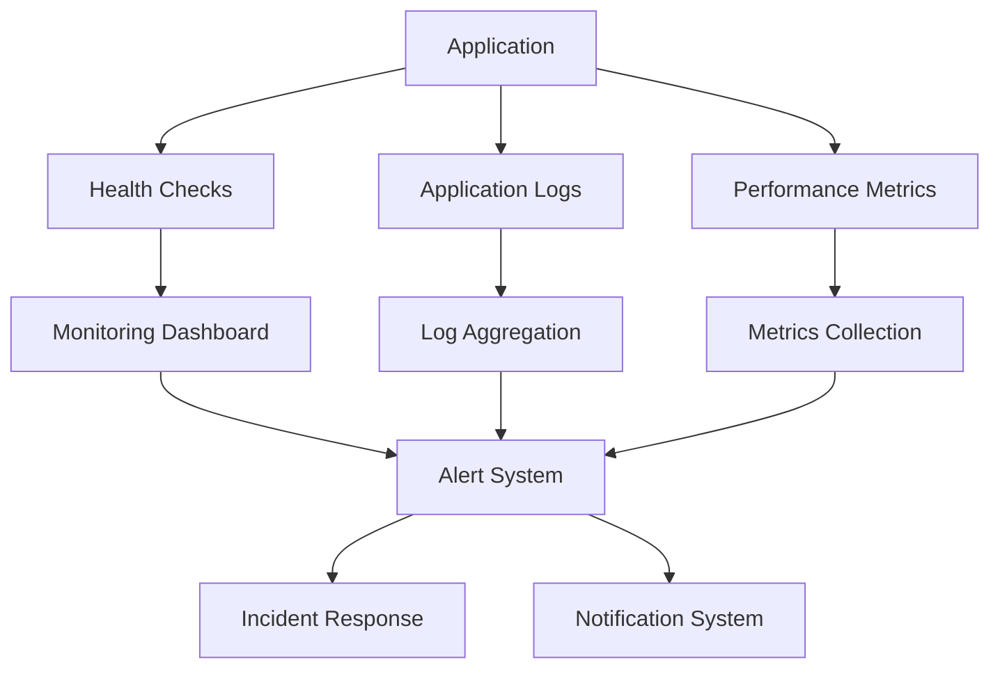

# TaskTidy Monitoring and Operations Documentation

## Overview

This document describes the comprehensive monitoring and observability system implemented for the TaskTidy application. The monitoring framework provides real-time visibility into application performance, health, and operational status, enabling proactive issue detection and rapid incident response.

## Monitoring Architecture

### Monitoring Stack



### Monitoring Components

1. **Application Monitoring**
   - Health check endpoints
   - Performance metrics
   - Error tracking
   - User experience monitoring

2. **Infrastructure Monitoring**
   - Azure App Service status
   - Database connectivity
   - Container health
   - Network performance

3. **Security Monitoring**
   - Vulnerability scanning
   - Security alerts
   - Access monitoring
   - Threat detection

## Health Check System

### Backend Health Endpoint

**Endpoint**: `/api/health`
**Method**: GET
**Frequency**: 30-second intervals

**Response Format**:
```json
{
  "status": "healthy",
  "timestamp": "2024-01-15T10:30:00.000Z",
  "environment": "production",
  "version": "1.0.0",
  "uptime": 3600,
  "services": {
    "database": "connected",
    "memory": "normal",
    "cpu": "normal"
  }
}
```

**Health Check Logic**:
```typescript
app.get('/api/health', async (req, res) => {
  try {
    // Check database connectivity
    const dbStatus = await checkDatabaseConnection();
    
    // Check system resources
    const systemStatus = await checkSystemResources();
    
    res.status(200).json({
      status: 'healthy',
      timestamp: new Date().toISOString(),
      environment: process.env.NODE_ENV || 'development',
      version: process.env.npm_package_version || '1.0.0',
      uptime: process.uptime(),
      services: {
        database: dbStatus,
        memory: systemStatus.memory,
        cpu: systemStatus.cpu
      }
    });
  } catch (error) {
    res.status(503).json({
      status: 'unhealthy',
      timestamp: new Date().toISOString(),
      error: error.message
    });
  }
});
```

### Frontend Health Check

**Endpoint**: Root URL (`/`)
**Method**: GET
**Frequency**: 30-second intervals

**Health Check Logic**:
- Verify application loads successfully
- Check for JavaScript errors
- Validate API connectivity
- Monitor page load performance

## Monitoring Dashboard

### Dashboard Configuration

**File**: `monitoring/dashboard.json`

**Dashboard Panels**:

1. **Application Health Panel**
   - Real-time service status
   - Response time monitoring
   - Error rate tracking
   - Availability metrics

2. **Performance Metrics Panel**
   - Response time graphs
   - Request rate monitoring
   - Throughput analysis
   - Resource utilization

3. **Infrastructure Status Panel**
   - Azure App Service health
   - Database connection status
   - Container registry status
   - Network connectivity

4. **Security Alerts Panel**
   - Vulnerability scan results
   - Security incident tracking
   - Compliance status
   - Threat detection alerts

### Dashboard Metrics

**Application Metrics**:
- Response time (p50, p95, p99)
- Request rate (requests/second)
- Error rate (percentage)
- Availability (uptime percentage)

**Infrastructure Metrics**:
- CPU utilization
- Memory usage
- Disk I/O
- Network throughput

**Business Metrics**:
- Active users
- Task creation rate
- API usage patterns
- User engagement

## Alerting System

### Alert Configuration

**Alert Types**:

1. **High Error Rate Alert**
   ```json
   {
     "id": "high-error-rate",
     "name": "High Error Rate Alert",
     "description": "Alert when error rate exceeds 10%",
     "condition": "error_rate > 10",
     "severity": "critical",
     "notification": {
       "email": ["admin@tasktidy.com"],
       "slack": "#alerts"
     }
   }
   ```

2. **Service Down Alert**
   ```json
   {
     "id": "service-down",
     "name": "Service Down Alert",
     "description": "Alert when any service is down",
     "condition": "health_status != 'healthy'",
     "severity": "critical",
     "notification": {
       "email": ["admin@tasktidy.com"],
       "slack": "#alerts"
     }
   }
   ```

3. **Security Vulnerability Alert**
   ```json
   {
     "id": "security-vulnerability",
     "name": "Security Vulnerability Alert",
     "description": "Alert when critical vulnerabilities are detected",
     "condition": "vulnerability_severity == 'critical'",
     "severity": "high",
     "notification": {
       "email": ["security@tasktidy.com"],
       "slack": "#security"
     }
   }
   ```

### Alert Severity Levels

**Critical**:
- Service completely down
- High error rate (>10%)
- Security breaches
- Data loss incidents

**High**:
- Performance degradation
- Security vulnerabilities
- Database connectivity issues
- High resource utilization

**Medium**:
- Warning thresholds exceeded
- Non-critical service issues
- Performance warnings
- Security warnings

**Low**:
- Informational alerts
- Maintenance notifications
- Non-urgent updates
- Status changes

## Logging System

### Log Configuration

**Log Levels**:
- **ERROR**: Application errors and exceptions
- **WARN**: Warning conditions
- **INFO**: General information
- **DEBUG**: Detailed debugging information

**Log Format**: JSON structured logging
```json
{
  "timestamp": "2024-01-15T10:30:00.000Z",
  "level": "info",
  "message": "Request processed successfully",
  "service": "tasktidy-backend",
  "requestId": "req-12345",
  "userId": "user-67890",
  "duration": 150,
  "statusCode": 200
}
```

**Log Outputs**:
1. **File Output**: `/var/log/tasktidy/app.log`
2. **Console Output**: Development and debugging
3. **Azure Application Insights**: Production monitoring
4. **Centralized Logging**: Log aggregation system

### Log Categories

**Application Logs**:
- Request/response logging
- Authentication events
- Business logic events
- Error tracking

**Infrastructure Logs**:
- Container startup/shutdown
- Health check results
- Resource utilization
- Network connectivity

**Security Logs**:
- Authentication attempts
- Authorization failures
- Security scan results
- Vulnerability alerts

## Performance Monitoring

### Key Performance Indicators (KPIs)

**Response Time Metrics**:
- **P50**: 200ms (median response time)
- **P95**: 500ms (95th percentile)
- **P99**: 1000ms (99th percentile)

**Throughput Metrics**:
- **Requests per second**: 100 RPS
- **Concurrent users**: 1000 users
- **Database queries**: 500 QPS

**Error Rate Metrics**:
- **Overall error rate**: <1%
- **5xx errors**: <0.5%
- **4xx errors**: <2%

### Performance Monitoring Tools

**Azure Application Insights**:
- Real-time application monitoring
- Performance analytics
- Error tracking
- User experience monitoring

**Custom Metrics**:
- Business-specific KPIs
- Custom performance counters
- Application-specific metrics
- User behavior analytics

## Incident Response

### Incident Classification

**Severity Levels**:

1. **P0 - Critical**
   - Complete service outage
   - Data loss or corruption
   - Security breach
   - Response time: Immediate

2. **P1 - High**
   - Significant performance degradation
   - Partial service outage
   - Security vulnerability
   - Response time: 1 hour

3. **P2 - Medium**
   - Minor performance issues
   - Non-critical service problems
   - Feature unavailability
   - Response time: 4 hours

4. **P3 - Low**
   - Cosmetic issues
   - Minor bugs
   - Enhancement requests
   - Response time: 24 hours

### Incident Response Process

**1. Detection**
- Automated monitoring alerts
- Manual incident reports
- User feedback
- System health checks

**2. Assessment**
- Incident severity classification
- Impact assessment
- Root cause analysis
- Stakeholder notification

**3. Response**
- Immediate mitigation actions
- Service restoration
- Communication to users
- Status updates

**4. Resolution**
- Root cause elimination
- Service verification
- Post-incident review
- Process improvement

**5. Recovery**
- Full service restoration
- Performance verification
- User communication
- Documentation update

## Operational Procedures

### Daily Operations

**Morning Health Check**:
1. Review overnight alerts
2. Check service status
3. Verify performance metrics
4. Review security scans

**Performance Monitoring**:
1. Monitor response times
2. Track error rates
3. Check resource utilization
4. Review user metrics

**Security Monitoring**:
1. Review vulnerability scans
2. Check access logs
3. Monitor security alerts
4. Verify compliance status

### Weekly Operations

**Performance Review**:
1. Analyze weekly metrics
2. Identify trends
3. Plan optimizations
4. Update capacity planning

**Security Review**:
1. Review security incidents
2. Update security policies
3. Plan security improvements
4. Conduct security training

**Maintenance Planning**:
1. Schedule maintenance windows
2. Plan updates and patches
3. Coordinate with development team
4. Prepare rollback procedures

### Monthly Operations

**Capacity Planning**:
1. Analyze growth trends
2. Plan infrastructure scaling
3. Update resource allocation
4. Optimize costs

**Security Assessment**:
1. Conduct security audits
2. Review compliance status
3. Update security policies
4. Plan security enhancements

**Performance Optimization**:
1. Identify bottlenecks
2. Plan performance improvements
3. Update monitoring thresholds
4. Optimize resource usage

## Monitoring Tools and Integrations

### Azure Monitoring

**Azure Application Insights**:
- Application performance monitoring
- Real-time telemetry
- Error tracking and analysis
- User experience monitoring

**Azure Monitor**:
- Infrastructure monitoring
- Log analytics
- Metrics collection
- Alert management

**Azure Security Center**:
- Security monitoring
- Threat detection
- Compliance monitoring
- Security recommendations

### Third-party Integrations

**Slack Integration**:
- Real-time alert notifications
- Incident communication
- Team collaboration
- Status updates

**Email Notifications**:
- Critical alert notifications
- Daily status reports
- Weekly performance summaries
- Monthly security reports

**PagerDuty Integration**:
- On-call notifications
- Escalation management
- Incident tracking
- Response automation

## Monitoring Best Practices

### 1. Comprehensive Coverage

**Monitor Everything**:
- Application performance
- Infrastructure health
- Security status
- Business metrics

**Multi-layer Monitoring**:
- Application layer
- Infrastructure layer
- Network layer
- Security layer

### 2. Proactive Monitoring

**Early Warning Systems**:
- Predictive analytics
- Trend analysis
- Capacity planning
- Performance forecasting

**Automated Response**:
- Auto-scaling
- Failover procedures
- Self-healing systems
- Automated rollbacks

### 3. Observability

**Three Pillars of Observability**:
- **Metrics**: Quantitative measurements
- **Logs**: Structured event data
- **Traces**: Request flow tracking

**Distributed Tracing**:
- Request correlation
- Performance analysis
- Error tracking
- Dependency mapping

## Future Enhancements

### 1. Advanced Monitoring

**AI-powered Monitoring**:
- Anomaly detection
- Predictive analytics
- Automated root cause analysis
- Intelligent alerting

**Real-time Analytics**:
- Stream processing
- Real-time dashboards
- Live performance monitoring
- Instant alerting

### 2. Observability Improvements

**Distributed Tracing**:
- End-to-end request tracking
- Performance bottleneck identification
- Dependency mapping
- Error correlation

**Advanced Logging**:
- Structured logging
- Log correlation
- Centralized log management
- Log analytics

### 3. Automation

**Self-healing Systems**:
- Automated incident response
- Self-recovery procedures
- Intelligent scaling
- Proactive maintenance

**DevOps Integration**:
- CI/CD pipeline monitoring
- Deployment tracking
- Rollback automation
- Performance regression detection

## Conclusion

The TaskTidy monitoring and operations framework provides comprehensive visibility into application performance, health, and security. The implementation includes real-time monitoring, automated alerting, comprehensive logging, and robust incident response procedures.

Key achievements:
- ✅ Real-time application monitoring
- ✅ Automated health checks
- ✅ Comprehensive alerting system
- ✅ Performance tracking and optimization
- ✅ Security monitoring and incident response
- ✅ Operational excellence and automation

The monitoring system ensures high availability, optimal performance, and rapid incident response, enabling the TaskTidy application to maintain excellent user experience and operational reliability. 