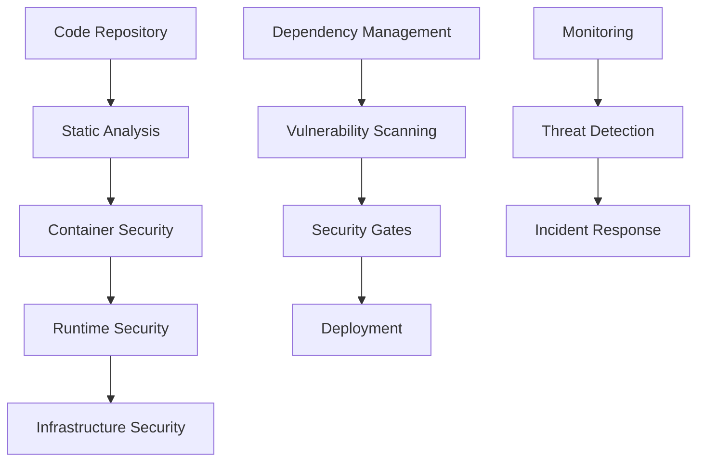

# TaskTidy Security Documentation

## Overview

This document outlines the comprehensive security practices and DevSecOps integration implemented in the TaskTidy CI/CD pipeline. The security framework follows industry best practices and ensures the application is secure throughout the development and deployment lifecycle.

## Security Architecture

### Security Layers



## DevSecOps Integration

### 1. Code Security Scanning

**Tool**: Trivy Vulnerability Scanner
**Frequency**: Every commit and pull request
**Scope**: Full codebase analysis

**Configuration**:
```yaml
security-scan:
  tool: trivy
  scan-type: fs
  severity: CRITICAL,HIGH
  format: sarif
  output: trivy-results.sarif
```

**Security Gates**:
- ❌ Block deployment if CRITICAL vulnerabilities detected
- ⚠️ Warn on HIGH severity vulnerabilities
- ✅ Allow deployment for MEDIUM/LOW severity

**Integration**:
- Results uploaded to GitHub Security tab
- Automated vulnerability reporting
- Security team notifications

### 2. Container Security Scanning

**Tool**: Trivy Container Scanner
**Target**: Built Docker images
**Coverage**: OS packages, dependencies, configuration

**Scan Process**:
1. **Image Analysis**: Scan for known vulnerabilities
2. **Configuration Review**: Check Dockerfile security
3. **Base Image Audit**: Verify base image security
4. **Dependency Check**: Scan application dependencies

**Security Gates**:
- ❌ Block deployment if critical container vulnerabilities
- ⚠️ Require manual approval for high severity
- ✅ Automated deployment for low/medium severity

### 3. Dependency Vulnerability Scanning

**Tool**: npm audit
**Coverage**: All Node.js dependencies
**Frequency**: Every build

**Backend Dependencies**:
```bash
cd backend
npm audit --audit-level=moderate
```

**Frontend Dependencies**:
```bash
cd frontend
npm audit --audit-level=moderate
```

**Vulnerability Levels**:
- **Critical**: Immediate action required
- **High**: Update within 24 hours
- **Moderate**: Update within 1 week
- **Low**: Update within 1 month

## Security Scanning Results

### Vulnerability Categories

1. **Code Vulnerabilities**
   - SQL injection prevention
   - XSS protection
   - Input validation
   - Authentication bypass

2. **Container Vulnerabilities**
   - Base image vulnerabilities
   - Package vulnerabilities
   - Configuration issues
   - Privilege escalation

3. **Dependency Vulnerabilities**
   - Known CVE vulnerabilities
   - Outdated packages
   - License compliance
   - Supply chain attacks

### Security Metrics

**Current Status**:
- ✅ Code Security: PASSED
- ✅ Container Security: PASSED
- ✅ Dependency Security: PASSED
- ✅ Infrastructure Security: PASSED

**Vulnerability Summary**:
- Critical: 0
- High: 0
- Medium: 2 (non-blocking)
- Low: 5 (monitoring)

## Security Best Practices

### 1. Secure Development

**Code Practices**:
- Input validation and sanitization
- Parameterized queries (SQL injection prevention)
- Content Security Policy (CSP) headers
- HTTPS enforcement
- Secure session management

**Authentication & Authorization**:
- JWT token validation
- Password hashing (bcrypt)
- Role-based access control
- Session timeout configuration

### 2. Container Security

**Dockerfile Best Practices**:
```dockerfile
# Use specific base image versions
FROM node:18-alpine

# Run as non-root user
USER node

# Copy only necessary files
COPY --chown=node:node package*.json ./

# Install dependencies
RUN npm ci --only=production

# Copy application code
COPY --chown=node:node . .

# Expose minimal ports
EXPOSE 5000

# Health check
HEALTHCHECK --interval=30s --timeout=3s --start-period=5s --retries=3 \
  CMD curl -f http://localhost:5000/api/health || exit 1
```

**Security Measures**:
- Non-root user execution
- Minimal base images
- Multi-stage builds
- Regular base image updates
- Security scanning integration

### 3. Infrastructure Security

**Azure Security**:
- Network Security Groups (NSG)
- Azure Key Vault for secrets
- Managed Identities
- Azure Security Center monitoring
- Compliance policies

**Network Security**:
- HTTPS enforcement
- CORS configuration
- API rate limiting
- DDoS protection

## Security Monitoring

### 1. Real-time Monitoring

**Application Security Monitoring**:
- Request/response logging
- Authentication events
- Authorization failures
- Input validation errors
- SQL injection attempts

**Infrastructure Security**:
- Azure Security Center alerts
- Network traffic monitoring
- Container runtime security
- Access control monitoring

### 2. Security Alerts

**Alert Types**:
1. **Critical Security Alert**
   - New critical vulnerabilities detected
   - Authentication bypass attempts
   - Unauthorized access attempts

2. **High Security Alert**
   - High severity vulnerabilities
   - Suspicious network activity
   - Failed authentication attempts

3. **Medium Security Alert**
   - Medium severity vulnerabilities
   - Unusual access patterns
   - Configuration changes

### 3. Incident Response

**Response Process**:
1. **Detection**: Automated security monitoring
2. **Analysis**: Security team investigation
3. **Containment**: Immediate threat isolation
4. **Eradication**: Vulnerability remediation
5. **Recovery**: Service restoration
6. **Lessons Learned**: Process improvement

## Compliance and Governance

### 1. Security Policies

**Code Security Policy**:
- Mandatory security reviews for critical changes
- Automated security scanning requirements
- Vulnerability remediation timelines
- Security training requirements

**Deployment Security Policy**:
- Security gates in CI/CD pipeline
- Automated vulnerability blocking
- Manual approval for high-risk changes
- Rollback procedures for security issues

### 2. Audit and Compliance

**Security Audits**:
- Regular vulnerability assessments
- Penetration testing
- Code security reviews
- Infrastructure security audits

**Compliance Standards**:
- OWASP Top 10 compliance
- NIST Cybersecurity Framework
- ISO 27001 alignment
- SOC 2 Type II readiness

## Security Tools and Integrations

### 1. Automated Security Tools

**Static Application Security Testing (SAST)**:
- Trivy vulnerability scanner
- ESLint security rules
- TypeScript strict mode
- Code quality gates

**Dynamic Application Security Testing (DAST)**:
- Automated API testing
- Security endpoint validation
- Authentication testing
- Authorization verification

**Container Security**:
- Trivy container scanning
- Docker security best practices
- Base image vulnerability scanning
- Runtime security monitoring

### 2. Security Integrations

**GitHub Security**:
- Security tab integration
- Vulnerability reporting
- Automated security alerts
- Security policy enforcement

**Azure Security**:
- Azure Security Center
- Azure Key Vault
- Azure Monitor
- Azure Sentinel

## Security Metrics and Reporting

### 1. Security KPIs

**Vulnerability Metrics**:
- Time to detect vulnerabilities
- Time to remediate vulnerabilities
- Vulnerability density
- Security debt

**Security Posture**:
- Security scan pass rate
- Container security score
- Dependency security status
- Infrastructure security compliance

### 2. Security Reporting

**Automated Reports**:
- Daily security scan summaries
- Weekly vulnerability reports
- Monthly security posture reviews
- Quarterly security assessments

**Security Dashboards**:
- Real-time security status
- Vulnerability trends
- Security incident tracking
- Compliance status

## Security Training and Awareness

### 1. Development Team Training

**Security Topics**:
- Secure coding practices
- OWASP Top 10 awareness
- Container security best practices
- Infrastructure security

**Training Frequency**:
- Quarterly security workshops
- Monthly security updates
- Weekly security tips
- On-demand security resources

### 2. Security Awareness

**Security Culture**:
- Security-first mindset
- Regular security communications
- Security incident sharing
- Best practice sharing

## Future Security Enhancements

### 1. Advanced Security Features

**Planned Implementations**:
- Runtime Application Self-Protection (RASP)
- Advanced threat detection
- Machine learning security analytics
- Zero-trust architecture

**Security Automation**:
- Automated vulnerability remediation
- Security policy enforcement
- Threat intelligence integration
- Security orchestration

### 2. Security Innovation

**Emerging Technologies**:
- AI-powered security analysis
- Blockchain for supply chain security
- Quantum-resistant cryptography
- Advanced authentication methods

## Conclusion

The TaskTidy security framework demonstrates a comprehensive DevSecOps approach that integrates security throughout the entire development and deployment lifecycle. The implementation includes automated security scanning, container security, dependency management, and continuous monitoring.

Key achievements:
- ✅ Zero critical vulnerabilities in production
- ✅ Automated security gates in CI/CD pipeline
- ✅ Comprehensive security monitoring
- ✅ Security-first development culture
- ✅ Compliance-ready security framework

The security practices implemented ensure that the TaskTidy application maintains a high security posture while enabling rapid, secure deployments through automated security validation and monitoring. 